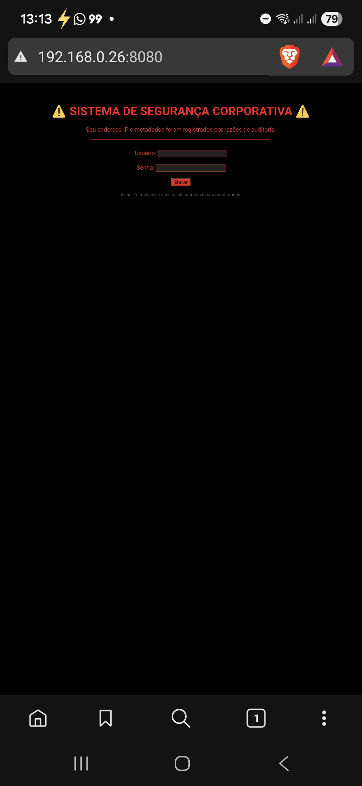

# Python HoneyPot PoC 🛡️

Este projeto é uma Prova de Conceito (PoC) de um HoneyPot de baixa interatividade, desenvolvido para monitoramento e detecção de acessos não autorizados em redes locais.

## 🚀 Funcionalidades
- **Defesa Ativa:** Simula um serviço web na porta 8080 para atrair e identificar intrusos.
- **Resposta Visual:** Exibe uma página de "Acesso Restrito" personalizada para quem tenta acessar via navegador.
- **Alertas Sonoros:** Emite um sinal sonoro (Beep) no host toda vez que uma conexão é detectada.
- **Logs de Auditoria:** Registra data, hora, IP de origem e cabeçalhos HTTP (User-Agent) em um arquivo de texto.

## 🛠️ Tecnologias Utilizadas
- **Python 3.x**
- Bibliotecas nativas: `socket`, `logging`, `datetime`, `winsound`.

## 📸 Demonstração

### 1. Inicialização do Sistema
O HoneyPot monitora todas as interfaces de rede na porta definida.

### 2. Visão do Intruso
Ao tentar acessar o IP do host, o navegador exibe um alerta de segurança corporativa.

### 3. Captura e Log
O sistema registra a tentativa de intrusão e os metadados do dispositivo atacante.

## 📋 Como Executar
1. Clone o repositório.
2. Certifique-se de estar no Windows (para o alerta sonoro `winsound`).
3. Execute o script: `python honeypot.py`.
4. Lembre-se de liberar a porta 8080 no seu Firewall para testes na rede local.

---
Desenvolvido por **Eduardo Ribeiro das Neves** para o blog [Criptografando Ideias](LINK_DO_POST_AQUI).
